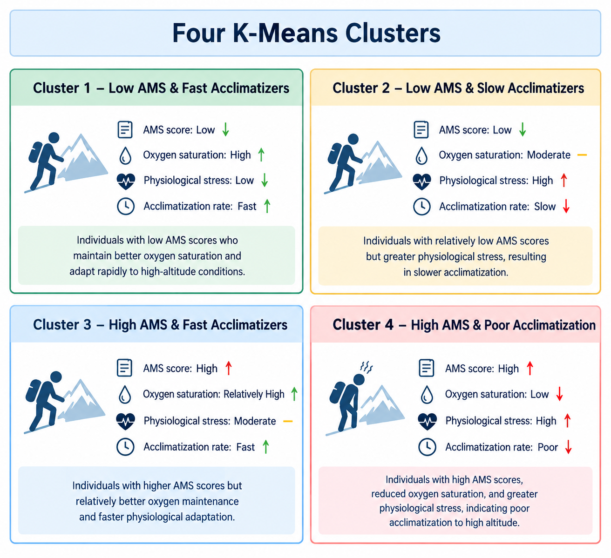

 ## 🏔️ Predictive Pipeline for Genetic Analysis of Acute Mountain Sickness using K Means Clustering and Naive Bayes 🏔️ 

 > **A computational biology and machine learning project investigating genetic, physiological and transcriptomic factors associated with susceptibility to Acute Mountain Sickness (AMS).**


 # About the Project

 **Acute Mountain Sickness (AMS)** is an altitude-related condition that may occur when an individual ascends to high-altitude environments where oxygen availability is reduced.

 Although environmental and physiological factors play an important role in AMS susceptibility, genetic variations significantly contribute to differences in individual responses to hypoxic environments.

 This project investigates the relationship between **genetic, physiological and transcriptomic characteristics** to establish their relation with AMS susceptibility using computational analysis and machine learning and focuses on identifying highly dominating genetic features that may be associated with different physiological response patterns.

 The overall analysis combines:

 - 🧬 Genetic data analysis
- 🫁 Physiological response analysis
- 📊 Exploratory data analysis
- 🤖 Unsupervised machine learning : K Means Algorithm
- 🧠 Supervised machine learning : Naive Bayes Algorithm
- 🔬 Candidate gene identification
- 📈 Biological interpretation


 # Methodology

 The project development took place in the following stages:

```
Data Collection
      ↓
Data Preprocessing
      ↓
Exploratory Data Analysis
      ↓
K-Means Clustering (K=4)
      ↓
Candidate Gene Selection
      ↓
Naive Bayes Classification
      ↓
AMS Susceptibility Prediction
      ↓
Biological Interpretation
```

---

 # Clusters formed during K Means Clsutering 

The data were initially organized into the required format using spreadsheet-based preprocessing and subsequently prepared for computational analysis. **Four** distinct clusters were formed to facilitate the systematic characterization of AMS patterns, individual physiological responses and susceptibility profiles for efficient downstream analysis and detection.



 After clustering, most dominating genes associated with the identified profiles were analysed to determine potentially relevant features which were used for predicting AMS susceptibility for a person based on his/her genetic profile.


 # Tech Stack Used

- **Python 3.9+** - Core programming language for data processing, machine learning, statistical analysis and model development
- **Pandas** - Data loading, integration, cleaning, preprocessing
- **NumPy** - Numerical computation, array operations, synthetic data generation
- **SciPy** - Statistical analysis using Welch’s t-test for cluster-wise gene selection
- **Scikit-learn** - Machine learning pipeline including K-Means clustering, Gaussian Naive Bayes, feature scaling, PCA, train-test splitting and model evaluation
- **Matplotlib** - Visualization of clusters, confusion matrices and ROC curves
- **OpenPyXL** - Reading and processing Excel-based genetic and physiological datasets
- **Joblib** - Serialization and persistence of trained machine learning models and preprocessing components
- **K-Means Clustering** - Unsupervised grouping of individuals into four AMS susceptibility and acclimatization profiles
- **Gaussian Naive Bayes** - Probabilistic classification of individuals into AMS and non-AMS categories
- **PCA** - Dimensionality reduction for visualizing high-dimensional cluster patterns
- **Welch’s t-test** - Statistical identification and ranking of genes associated with individual clusters
- **Git & GitHub** - Version control and repository management for the project

### Programming and Development

<p align="center">
  
</p>

### Machine Learning & Data Science

<p align="center">
  
  
  
  
  
</p>

### Machine Learning Methods

<p align="center">
  
  
  
  
</p>

# Results 
Successful Generation and Integration of Clinical, Physiological, Transcriptomic and Lake Louise Score Data for AMS Risk Analysis, K-Means Clustering and Naive Bayes Prediction

<br>
**Stage 1 of  Machine Learning-Based Genetic Analysis of AMS pipeline**  : Data preprocessing and unsupervised learning stage: Integrating multimodal AMS datasets, train-test split and applying K-Means clustering (K=4) to identify distinct physiological and AMS acclimatization profiles. 

<br>
**Stage 2 of  Machine Learning-Based Genetic Analysis of AMS pipeline** : The top five genes identified from each of the four K-Means clusters, resulting in 20 selected candidate genes associated with distinct AMS and acclimatization profiles.

<br>
**Stage 3 of  Machine Learning-Based Genetic Analysis of AMS pipeline** : The Naive Bayes classifier achieved 99.0% accuracy, with 96.15% precision, 100% recall, 98.04% F1-score, 98.67% specificity and an AUC of 1.00 on the test set.


# Quick Setup

### Create virtual environment
python -m venv venv

### Activate environment - Windows
venv\Scripts\activate

### Activate environment - macOS/Linux
source venv/bin/activate

### Install dependencies
pip install -r requirements.txt

### Run Training
python train.py

 # 📄 License

 This was the **second** project which had been independently developed by me during my two-months research internship at the **Defence Research and Development Organisation (DRDO), Ministry of Defence, Government of India**. The project is intended for research and educational purposes. **This repository does not represent an official DRDO publication, endorsement or release.**

 Copyright © 2026 **Vamika Arya**

---

 # 👩🏻‍💻 Author

 **Vamika Arya**

 <p align="center">
  <a href="https://www.linkedin.com/in/vamika-arya-4a0179288/">
    
  </a>
</p>
